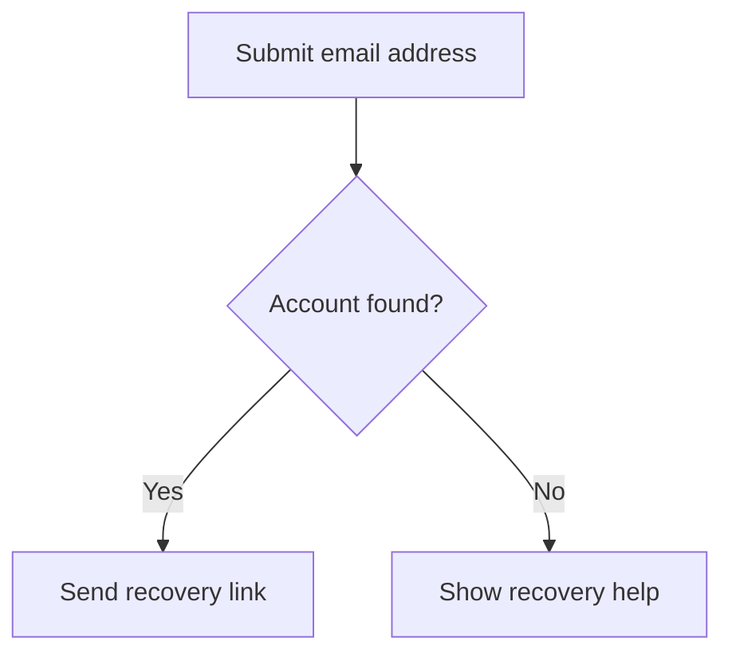
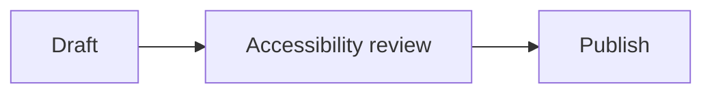

# Mermaid Diagrams Accessibility Skill

> **Canonical source**: `examples/MERMAID_ACCESSIBILITY_BEST_PRACTICES.md` in `mgifford/ACCESSIBILITY.md`
> This skill is derived from that file. When in doubt, the example is authoritative.

Apply these rules when authoring, generating, or reviewing Mermaid diagrams.
**Only load this skill if the project uses Mermaid diagrams.**

---

## Core Mandate

Accessible Mermaid content depends on four layers: (1) the diagram source and
its accessibility metadata, (2) the exact Mermaid renderer and configuration,
(3) the generated SVG/raster output, and (4) how the publishing platform
embeds and exposes that output. A generated Mermaid diagram is non-text
content unless the rendered nodes/relationships are proven to have useful
semantics — test the final published output, not just the source or an
editor preview.

Before authoring, decide whether a diagram is even needed — a heading, short
list, table, or few sentences may communicate the information more clearly.
Mermaid is useful when relationships, sequence, branching, hierarchy, timing,
or spatial grouping materially improve understanding.

---

## Severity Scale (this skill)

| Level | Meaning |
|---|---|
| **Critical** | Diagram conveys essential information with no accessible title or alternative; metadata written with the wrong syntax so it's silently ignored |
| **Serious** | Title present but no description on a complex diagram; contrast fails |
| **Moderate** | No visible structured alternative for a complex diagram type; named edges lack context |
| **Minor** | Duplicate IDs; missing renderer-version verification |

---

## Critical: Use the Correct `accTitle`/`accDescr` Syntax — No `%%` Prefix

**`%%` is the Mermaid comment prefix.** Lines written as `%%accTitle …` or
`%%accDescr …` are comments and are **silently ignored** — this produces no
accessibility metadata at all while looking like it works.

```
# WRONG — these are Mermaid comments and do nothing
%%accTitle This is ignored as a comment
%%accDescr This is also ignored as a comment
```

**Correct syntax** uses `accTitle:` and `accDescr:` directly, with no comment prefix:



Single-line description uses a colon:



For a **multi-line** description, omit the colon after `accDescr` and use braces:


Mermaid does **not** define a universal 100-character title limit or 500-
character description limit — write the shortest title that distinguishes
the diagram on the page, and keep the description concise enough to be
useful as an image description (move detailed steps into visible structured
HTML instead of stuffing them into `accDescr`).

**Do not invent directives** like `%%a11y-node` or `%%a11y-edge` — these are
not standard Mermaid syntax; they're comments unless a project-specific
preprocessor implements them, and should never be documented as Mermaid features.

Parse and render the source with the project's exact Mermaid version to
catch syntax-support and diagram-type differences — `accTitle`/`accDescr`
support varies by version and diagram type.

---

## Writing Useful Titles and Descriptions

**Title:** identifies the subject, distinguishes it from others on the page,
includes the diagram type only when it helps, avoids filenames/internal IDs/
generic labels ("Diagram"). Examples: "Account recovery decision flow",
"Payment service request sequence", "Order states and permitted transitions".

**Description:** states the purpose, starting context, main elements/
participants, essential sequence/hierarchy/relationships, important
decisions/exceptions/outcomes, and where a complete alternative is available.
Do not merely list colors and shapes ("A blue rectangle points to a green
diamond" describes appearance, not meaning) and do not flatten every node
label into one long sentence — that's hard to navigate and loses structure.

**Also provide a visible title/description** — a page heading or figure
caption helps everyone, not just AT users:

```html
<figure aria-labelledby="recovery-flow-heading">
  <h2 id="recovery-flow-heading">Account recovery flow</h2>
  <pre class="mermaid">
flowchart TD
    accTitle: Account recovery decision flow
    accDescr: A recovery request either sends a link or offers additional help.
    A[Submit email address] --&gt; B{Account found?}
  </pre>
  <figcaption><a href="#recovery-flow-description">Read the account recovery steps</a>.</figcaption>
</figure>
```

(The `&gt;` escaping is only needed when Mermaid source is embedded directly
in HTML — Markdown Mermaid fences don't need it.)

---

## Serious: Provide a Visible Structured Alternative for Complex Diagrams

`accDescr` creates an SVG description, not a navigable document structure.
Complex diagrams need visible HTML with headings, lists, tables, and links.

| Mermaid diagram type | Useful structured alternative |
|---|---|
| Flowchart / decision tree | Ordered steps + nested lists or a decision table (conditions → outcomes) |
| Sequence diagram | Participant list + chronological message table |
| State diagram | State definitions + transition table (trigger, source, destination, outcome) |
| Class diagram | Class definitions, properties, methods, inheritance, relationship table |
| Entity relationship | Entity definitions, keys, attributes, cardinality, relationship table |
| Gantt / timeline | Task/event table with dates, duration, owner, status, dependencies |
| Pie/XY/quadrant/radar/Sankey | Summary of findings + underlying data table with units |
| Mind map / tree | Properly nested heading or list hierarchy |
| Architecture/C4/block | Component inventory, responsibilities, boundaries, relationship table |
| Git graph | Chronological branch/merge/release history |
| User journey | Ordered stages, goals, actions, emotions, barriers, opportunities |

```html
<section id="recovery-flow-description" aria-labelledby="recovery-flow-description-heading">
  <h3 id="recovery-flow-description-heading">Account recovery steps</h3>
  <ol>
    <li>The user submits an email address.</li>
    <li>The system checks for an account:
      <ul>
        <li>If found, send a recovery link and confirm it was sent.</li>
        <li>If not found, show recovery help and offer support.</li>
      </ul>
    </li>
  </ol>
</section>
```

**Keep alternatives synchronized** — generate the diagram and its alternative
from the same reviewed data model when possible; if maintained separately,
require both in the same change, compare nodes/values/edges, and assign an
owner for content review. **Do not expose raw Mermaid source as the only
alternative** — it may help developers but is not an equivalent explanation
for all users.

---

## Serious: Understand Mermaid's Generated SVG (Do Not Hand-Author a Different Pattern)

Current Mermaid documentation states the renderer automatically adds
`aria-roledescription` based on diagram type, and when `accTitle`/`accDescr`
are provided, generates `<title>`/`<desc>` elements with `aria-labelledby`
referencing the title and **`aria-describedby`** referencing the description
— **separately**, not both combined into one `aria-labelledby`:

```html
<svg aria-labelledby="generated-title-id"
     aria-describedby="generated-description-id"
     aria-roledescription="flowchart-v2"
     id="generated-diagram-id">
  <title id="generated-title-id">Account recovery decision flow</title>
  <desc id="generated-description-id">A recovery request either sends a link or offers additional help.</desc>
</svg>
```

**Do not rewrite both as one `aria-labelledby` value without a tested
reason** — a label identifies the image; a description provides additional
information; they're distinct relationships. Exact IDs/classes/attributes
can change by Mermaid version — don't copy generated IDs into source or
depend on undocumented internal class names.

**Node-by-node semantics are not automatic.** `accTitle`/`accDescr` describe
the diagram as a whole — they do not make every node/edge/arrow a useful
accessible object. **Do not automatically add `role="list"`/`role="listitem"`
to generated SVG groups** — a visual layout is not necessarily a list, DOM
order may not match reading order, and list semantics can't express
branching, cardinality, or graph relationships. If users need to inspect
individual items, build and test a purpose-specific interactive component —
generated SVG internals are a fragile foundation for a complex widget.

**IDs** need to be unique in the final HTML document (not across unrelated
pages). Let Mermaid manage its generated IDs; check for duplicates when
several inline diagrams share a page; use `deterministicIds` config for
stable snapshot testing; preserve every referenced ID through sanitization/export.

---

## Serious: Embedding and Export Modes Change the Rules

| Mode | Responsibility |
|---|---|
| Inline SVG generated in the page | Preserve generated title/description/ARIA references, language, styles, unique IDs |
| External SVG via `` | Give the HTML `alt` — do not assume the SVG's internal title/desc are exposed |
| Raster PNG/JPEG | HTML `alt` + long structured alternative in HTML |
| `<object>`/iframe | Useful accessible name on the embedding element; test entry/exit; external HTML alternative |
| CSS background image | Decoration only, or provide the info in ordinary HTML |
| PDF/office-document export | Document tags, alt text, reading order — SVG metadata is not a substitute |
| Markdown platform renderer | Test the platform's exact Mermaid version, sanitizer, theme, and output |

```html
<figure>
  
  <figcaption><a href="#recovery-flow-description">Read the complete account recovery steps</a>.</figcaption>
</figure>
```

Do not leave HTML `alt` empty just because the source SVG contains `<title>`/`<desc>`.

---

## Choosing Clear Diagram Content

**Nodes/participants:** human-readable labels, not internal IDs; expand
uncommon abbreviations; keep labels concise but meaningful; give visually
similar nodes distinct textual labels; don't use shape alone to distinguish a
decision/process/database/external system.

**Edges/relationships:** label branches when the outcome isn't otherwise
clear — "Approved"/"Needs revision" over generic "Yes"/"No"; preserve
direction and source→destination meaning in the alternative; explain
unlabeled relationships depending on line style or position; don't use
connector color alone to encode status or relationship type.

**Reading order/layout:** choose a direction matching content and document
language; reduce line crossings; avoid layouts implying relationships
through proximity alone. Visual placement is not a programmatic reading
order — state the intended sequence/hierarchy in the description and structured alternative.

---

## Moderate: Color and Contrast

Apply WCAG 2.2 ratios: normal text ≥4.5:1; large-scale text ≥3:1 (don't
treat 18 CSS pixels alone as the large-text threshold — check WCAG's actual
definition); visual information required to understand meaningful nodes/
boundaries/connectors/states ≥3:1 (WCAG 1.4.11). Not every decorative fill
needs 3:1 against every neighboring fill when labels/outlines preserve the
information. Use WCAG 2.x contrast for WCAG 2.2 conformance — APCA/WCAG 3
work is research to monitor, not a substitute test.

Combine color with: direct labels, line styles, patterns, icons with text
alternatives, border treatments, or values in the structured alternative —
for status, ownership, participant groups, critical paths, and selected states.

**Test actual themes** — centralize theme configuration rather than styling
individual elements by unstable internal selectors; test text/fills/borders/
connector lines/arrowheads/labels/focus/data marks in every supported light
and dark presentation and inside the actual background/container colors;
test forced-colors mode and keep the structured alternative usable when SVG
styling is lost. **Do not assume selecting Mermaid's `dark` theme or adding a
`prefers-color-scheme` rule automatically produces accessible dark mode** —
recheck themes after Mermaid updates.

---

## Responsive Layout, Zoom, and Reflow

Include a useful `viewBox` in exported SVG; don't clip the diagram at 200%/
400% zoom; let users open a larger view or download an SVG when that helps;
keep the visible title/summary/alternative/controls reflowable; test long
labels and translations; never disable browser zoom. WCAG 1.4.10's
two-dimensional-layout exception can apply to a complex diagram itself, but
the surrounding title, description, controls, and structured alternative
still need to reflow.

---

## Serious: Keyboard and Interactive Diagrams

**Static diagrams do not need `tabindex="0"`** — keyboard focus should move
to links/buttons/controls, not every decorative SVG group. If a diagram is
visually scrollable, ensure keyboard users can reach and scroll its
container without becoming trapped, and still provide a structured
alternative that doesn't depend on 2D scrolling.

**Avoid putting the only path to essential links/actions inside a diagram**
— provide visible HTML links/controls nearby. If Mermaid links/click actions
are enabled: each link is keyboard reachable; purpose is understandable from
its accessible name; focus is visible and unobscured; pointer and keyboard
actions produce the same result; the accessible name includes the visible
label; target size and hover/focus content meet applicable criteria; every
action has an equivalent HTML path. **Do not simulate a button with a
non-focusable generated SVG group.**

For interactive exploration (select nodes, expand branches, filter, inspect
details), build an accessible interaction model outside the generated static
SVG, or use a tested component — Mermaid source plus ARIA attributes does
not by itself define an accessible graph-navigation widget.

---

## Motion and Animation

Avoid decorative animation. If animation/auto-updates/moving paths are added
by a host or plugin: provide pause/stop/hide controls where WCAG 2.2.2
applies; respect `prefers-reduced-motion`; avoid flashes exceeding WCAG
thresholds; don't use motion as the only change indicator; keep the final
state available in text. Don't make accessibility claims about Mermaid
animation without testing the exact version/integration.

---

## Critical: Secure and Stable Rendering

Accessibility and security can fail together when untrusted diagram source
can inject markup. Keep Mermaid's `securityLevel: 'strict'` default unless a
reviewed use case requires another mode — do not lower security merely to
add essential links (put them in HTML instead). Treat user-supplied Mermaid
source as untrusted input; use supported sanitization and a restrictive CSP;
pin Mermaid/renderer dependencies via the project's lockfile when
self-managed; for platform-managed rendering, record the observed version,
date, discovery method, and tested capabilities. Do not load production
dependencies from an unpinned `@latest` URL. Limit source size/complexity to
prevent rendering failures; render errors as accessible text without
exposing sensitive details.

**Controlled vs. platform-managed renderers:**

| Model | Version evidence | Responsibility |
|---|---|---|
| Self-managed | Package manifest, lockfile, container digest | Pin, review updates, test output, keep a rollback path |
| Platform-managed (GitHub.com, Pages, Enterprise) | Version probe, dated observation | Record what was observed, test required capabilities, maintain an alternative, recheck after platform changes |
| Pre-rendered static export | Version recorded by the export job | Preserve export with source and alternative; test the final embedding context |

**GitHub.com Markdown, GitHub Enterprise Server, GitHub Pages, local
previews, and exported files are separate rendering surfaces** — do not
infer support on one surface from successful rendering on another. GitHub
Pages does not automatically inherit GitHub.com's Mermaid renderer; the
Jekyll theme/plugin/build pipeline determines whether and how Mermaid
renders there.

Discover a hosted version with the `info` diagram:

```mermaid
info
```

This is a **live diagnostic, not a pinned dependency** — it may change
without a commit, and only reports the renderer on the surface where it's
displayed. Record it as a dated plain-text observation, not the only
accessible record: `Last manually observed on GitHub.com: Mermaid x.y.z on YYYY-MM-DD.`

Verify capabilities per surface, not just the version number: required
diagram types parse and render; `accTitle`/`accDescr` produce the expected
title/description/ARIA relationships; the host's sanitizer preserves
required semantics; light/dark/forced-colors remain understandable; multiple
diagrams per page don't produce conflicting IDs; the structured alternative
remains available if rendering fails.

---

## Authoring and Review Workflow

**Before authoring:** decide whether a diagram materially improves
understanding; identify purpose/audience/essential relationships/alternative
format; confirm the target renderer supports the diagram type and
accessibility syntax.

**During authoring:** add valid `accTitle:`/`accDescr:` lines (no `%%`
prefix); use clear labels; keep visual complexity proportionate; avoid
color-only/shape-only meaning; write the structured alternative alongside
the source; keep essential links/controls in HTML.

**Before publication:** render with the pinned production version (or record
the platform-managed version and verify capabilities); inspect the generated
SVG and final accessibility tree; validate the structured alternative
against the diagram; test all supported themes/zoom/viewports/exports; test
the actual host (not just an editor preview); record reviewer/version/date/limitations.

**AI-generated diagrams:** treat as a draft — verify every node/edge/value/
relationship against source material; rewrite generic accessibility
descriptions; check the structured alternative matches the final diagram;
reject invented Mermaid directives; don't infer accessibility/security/
conformance from successful visual rendering alone.

---

## Linting and Automated Validation

**Source checks:** the exact source parses with the target renderer;
`accTitle:` is present and not commented out (i.e., not prefixed with `%%`);
`accDescr:` or `accDescr { ... }` is present and not commented out; values
are non-empty; prohibited custom directives aren't mistaken for real syntax;
a complex diagram references a visible structured alternative. Don't enforce
arbitrary universal character-count limits.

**Rendered-output checks:** generated `<title>`/`<desc>` exist; `aria-labelledby`
resolves to the title; `aria-describedby` resolves to the description; IDs
unique in the final page; sanitization/optimization didn't remove referenced
elements; no unintended focusable descendants; interactive elements have
names/roles/states/keyboard behavior/visible focus; render errors exposed as text.

**Contrast checks** need actual rendered pairs (text vs. effective
background, boundaries, connector lines, focus states) in every supported
theme — "monochrome" is not a reason to skip contrast testing.

Automation cannot determine whether the description is equivalent, reading
order is meaningful, or the diagram is understandable — manual and user review required.

---

## Testing

* **Content/equivalent-purpose:** state the question the diagram should
  answer; identify every essential relationship/branch/value; answer using
  the visual diagram, then using only the title/description/structured
  alternative; compare available information and conclusions; correct both
  representations together
* **Keyboard:** confirm static SVG isn't an unnecessary Tab stop; operate
  every diagram link/control/popup; verify visible focus and logical order;
  enter/leave scrollable diagrams without a trap; confirm every action has
  an equivalent HTML path
* **Screen reader:** confirm the computed accessible name/description; check
  whether the diagram is exposed as image/graphic/document by the final
  host; read the structured alternative by headings/lists/tables; confirm no
  duplicate/excessive announcements
* **Visual/low-vision:** normal and large text; 200%/400% zoom; narrow
  viewports/orientations; every light/dark presentation; forced-colors mode;
  confirm labels/nodes/lines/arrowheads/legends stay visible; long
  translations don't overlap
* **Export/platform:** test the original Markdown/source preview AND the
  production page after sanitization/optimization; record whether each
  tested renderer is pinned or platform-managed; test inline SVG, external
  SVG, and raster variants; test print/PDF; test with JavaScript unavailable
  or rendering failed; test several diagrams on one page for duplicate IDs;
  retest after Mermaid/plugin/theme/host updates

---

## Common Failures

| Failure | Correction |
|---|---|
| Writing `%%accTitle` or `%%accDescr` | Use `accTitle:` and `accDescr:` **without** the `%%` comment prefix |
| Requiring arbitrary 100-char/500-char limits | Write concise useful metadata; use visible structure for detail |
| Treating successful rendering as proof of accessibility | Inspect the final SVG, accessibility tree, host, and alternative |
| Depending only on `<desc>` for a complex diagram | Provide visible headings, lists, tables, or prose |
| Exposing raw Mermaid source as the only alternative | Provide a plain-language, task-appropriate representation |
| Adding list semantics to every generated SVG group | Treat the diagram as a whole, or build a tested purpose-specific interface |
| Replacing `aria-describedby` with `aria-labelledby` for the description | Preserve distinct label and description relationships |
| Generating title IDs from timestamps/random strings | Let Mermaid manage IDs; use `deterministicIds` where stability is required |
| Treating `xmlns` as a general accessibility attribute | Required for serialized standalone SVG, not universal inline-SVG metadata |
| Inventing `%%a11y-node`/`%%a11y-edge` syntax | Use supported Mermaid syntax or a documented real preprocessing extension |
| Using 18 CSS pixels as the large-text threshold | Apply WCAG's actual large-scale text definition |
| Assuming a dark Mermaid theme passes dark-mode requirements | Test actual colors in every supported presentation |
| Making static diagrams keyboard focusable | Keep static graphics out of the Tab order |
| Loading Mermaid from an unpinned `@latest` dependency | Pin and review the production renderer version |
| Describing a platform-managed renderer as pinned | Record observed version, date, discovery method, tested capabilities |
| Assuming GitHub Pages uses GitHub.com's Mermaid version | Identify the renderer supplied by the Pages theme/plugin/build pipeline |
| Using `securityLevel: 'loose'` without need | Keep strict security defaults; put essential interaction in HTML |

---

## Definition of Done Checklist

* [ ] `accTitle:` present using correct syntax (no `%%` prefix), concise and unique
* [ ] `accDescr:` or `accDescr { ... }` present, explains purpose and key relationships
* [ ] Mermaid version confirmed/recorded for the actual publishing surface(s)
* [ ] Generated SVG verified: `<title>`, `<desc>`, `aria-labelledby` (title) and
      `aria-describedby` (description) kept as **separate** relationships
* [ ] Complex diagram has a visible structured alternative matched to its diagram type
* [ ] Diagram and alternative are synchronized from the same data/change
* [ ] All IDs unique within the final page
* [ ] Decorative elements excluded from the accessibility tree; no fabricated `role="list"` on generated groups
* [ ] Named edges include contextual labels ("Yes, proceed to X" not "Yes")
* [ ] Contrast verified in light, dark, and forced-colors modes
* [ ] Static diagrams are not unnecessary Tab stops; essential links exist as real HTML links too
* [ ] Each publishing surface (GitHub.com, GitHub Pages, local preview, exports) tested separately
* [ ] `securityLevel: 'strict'` retained unless a reviewed exception is documented
* [ ] Tested with a screen reader

---

## Key WCAG Criteria

* 1.1.1 Non-text Content (A) — **Critical if no title/alternative**
* 1.3.1 Info and Relationships (A)
* 1.4.1 Use of Color (A)
* 1.4.3 Contrast Minimum (AA)
* 1.4.10 Reflow (AA)
* 1.4.11 Non-text Contrast (AA)
* 2.1.1 Keyboard (A)
* 2.4.7 Focus Visible (AA)
* 4.1.2 Name, Role, Value (A)
* 4.1.3 Status Messages (AA)

---

## References

* [Full best practices guide](https://github.com/mgifford/ACCESSIBILITY.md/blob/main/examples/MERMAID_ACCESSIBILITY_BEST_PRACTICES.md)
* [Mermaid diagram types reference](https://github.com/mgifford/ACCESSIBILITY.md/blob/main/examples/MERMAID_DIAGRAM_TYPES.md)
* [Mermaid transformation best practices](https://github.com/mgifford/ACCESSIBILITY.md/blob/main/examples/MERMAID_TRANSFORMATION_BEST_PRACTICES.md)
* [Mermaid: Accessibility Options](https://mermaid.ai/open-source/config/accessibility.html)
* [Mermaid: Security](https://mermaid.ai/open-source/community/security.html)
* [GitHub: Checking your version of Mermaid](https://docs.github.com/en/get-started/writing-on-github/working-with-advanced-formatting/creating-diagrams#checking-your-version-of-mermaid)
* [WAI-ARIA 1.2: `aria-roledescription`](https://www.w3.org/TR/wai-aria-1.2/#aria-roledescription)

> **Standards horizon:** These rules target WCAG 2.2 AA.
> Monitor: <https://www.w3.org/TR/wcag-3.0/>
