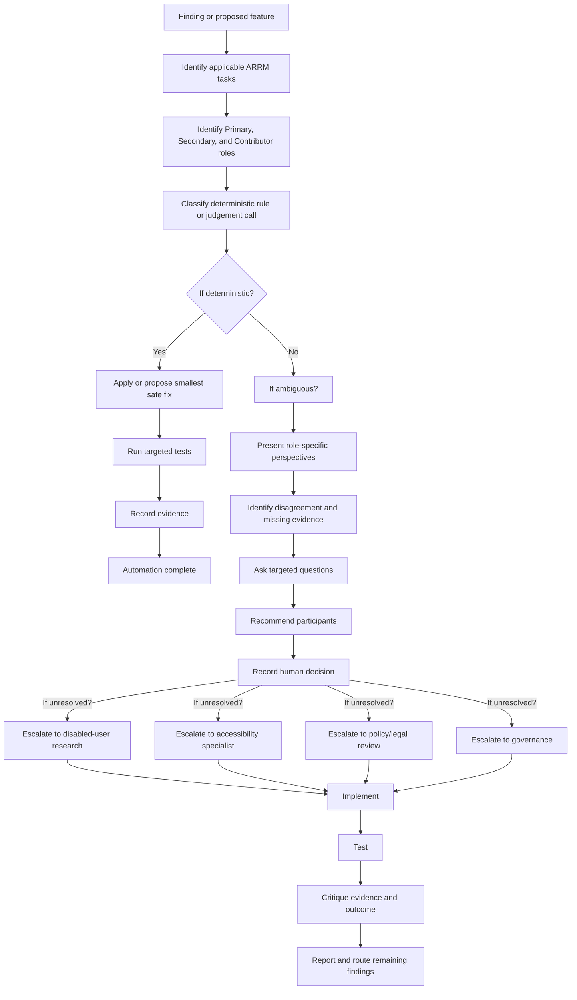

# Role-Aware Accessibility Workflow - End-to-End Process

## Overview

This document describes the complete end-to-end workflow for accessibility work in the role-aware accessibility architecture.

## Process Flow

### Stage 1: Finding or Proposed Feature
Identify an accessibility concern or proposed change.

### Stage 2: Execution Details

#### Finding Collection
- **Planner**: Identifies ARRM tasks and role ownership
- **Tester**: Collects reproducible evidence and runs automated checks
- **Perspective Auditor**: Examines impacts for specific user groups

#### Evidence Processing
1. Map finding to relevant ARRM tasks
2. Identify which professional roles own responsibility
3. Classify as deterministic or judgement-call
4. If deterministic: apply fix, run tests, document
5. If ambiguous: present perspectives, ask questions, recommend participants

#### Decision Making
- **Auto-fixable**: Clear technical violation, low risk, can be automated
- **Human-confirmation-needed**: Requires human validation of unambiguous requirement
- **Cross-role-decision-needed**: Multiple roles involved, requires consensus
- **User-research-needed**: Requires direct input from disabled users
- **Specialist-review-needed**: Requires external expertise
- **Governance-decision-needed**: Requires policy, legal, or security review
- **Insufficient-evidence**: Cannot determine due to missing information

### Stage 3: Integration Points

#### With Topic Skills
Each AI workflow knows which topic skills are relevant:

| AI Workflow | Relevant Topic Skills |
|-------------|----------------------|
| Planner | forms, keyboard, color-contrast, content-design |
| Critic | bug-reporting, manual-testing |
| Tester | manual-testing, axe-rules |
| Perspective Auditor | forms, keyboard, visual-design |
| Bug Reporter | bug-reporting |

#### With Professional Roles
The system respects role ownership for:

- **Primary Ownership**: Decisive authority on task execution
- **Secondary Ownership**: Advisory role, can challenge Primary decisions
- **Contributor**: Provides technical implementation or validation

#### With User Perspectives
Each finding is examined for impacts on:

- screen-reader and semantic access
- keyboard and motor access
- magnification and reflow
- cognitive and neurodivergent access
- auditory access
- environmental contrast
- vestibular and motion access

### Stage 4: Quality Gates

#### Evidence Quality
- **Reproducible**: Steps to reproduce are clearly documented
- **Verifiable**: Conditions under which evidence was collected
- **Contextual**: Relevant to the specific implementation
- **Complete**: Includes expected and actual behavior

#### Decision Quality
- **Role-aware**: Questions targeted to appropriate professional roles
- **Evidence-based**: Decisions supported by documented evidence
- **Transparent**: Conflicts and uncertainty are visible
- **Accountable**: Human decision-makers are identified

## Role-Specific Workflows

### Content Authoring Workflow
1. Review text and content structure
2. Ensure semantic HTML for information hierarchy
3. Check for plain language requirements
4. Validate accessible error messages
5. Verify document structure and reading order

### Front-End Development Workflow
1. Verify semantic HTML first
2. Implement progressive enhancement
3. Ensure keyboard accessibility
4. Support all assistive technologies
5. Test across browsers and devices

### User Experience Design Workflow
1. Center user needs and disabilities
2. Design for diverse access methods
3. Consider cognitive load and complexity
4. Plan for device and environment variations

### Visual Design Workflow
1. Test in light and dark modes
2. Ensure sufficient contrast ratios
3. Consider motion and animations
4. Account for various display conditions

### Testing Workflow
1. Test with real assistive technologies
2. Test with keyboard-only navigation
3. Test at 200% zoom
4. Verify semantic HTML and structure
5. Document findings with clear reproduction steps

## Success Criteria

### First Iteration
The first iteration is complete when:

1. **ARRM task data is available** with provenance
2. **Role-specific indexes can be generated** from the ARRM CSV
3. **Professional roles and AI workflows are clearly separated**
4. **The Planner can identify relevant ARRM assignments** for any finding
5. **The Planner can distinguish auto-fix from judgement call**
6. **Ambiguous work produces role-specific questions**
7. **Conflicting perspectives remain visible**
8. **The workflow recommends appropriate human participants**
9. **Unresolved uncertainty can be escalated**
10. **At least three evaluation fixtures pass**
11. **Existing repository validation still passes**
12. **Documentation clearly states that human roles retain accountability**

### Quality Attributes

1. **Automation**: Maximizes deterministic automation where possible
2. **Clarity**: Clearly distinguishes between automation and judgement
3. **Accountability**: Human roles retain ownership of decisions
4. **Evidence**: Preserves evidence for human interpretation
5. **Collaboration**: Facilitates cross-role communication and decision-making
6. **Transparency**: Makes conflicts and uncertainty visible
7. **Escalation**: Supports appropriate escalation when needed

## Monitoring and Improvement

### Metrics

1. **Automation rate**: Percentage of findings auto-fixed
2. **Escalation rate**: Percentage requiring human or governance decisions
3. **Time-to-decision**: Duration from finding to human decision
4. **Evidence completeness**: Percentage of findings with complete evidence

### Review Cadence

- **Weekly**: Review automation vs. manual decision ratios
- **Monthly**: Review role-specific performance and conflicts
- **Quarterly**: Review governance escalation patterns
- **Annually**: Review entire workflow effectiveness

## Evolution Path

The system is designed to evolve:

1. **Expand role coverage**: Add more ARRM professional roles
2. **Enhance automation**: Increase coverage of auto-fixable findings
3. **Improve evidence**: Add more automated evidence collection
4. **Refine triage**: Improve escalation path decision making
5. **Integrate testing**: Better integration with existing accessibility testing infrastructure

## References

- [W3C WAI ARRM Project](https://github.com/w3c/wai-arrm) - Source of role and task mapping
- [zivtech/accessibility-skills](https://github.com/zivtech/accessibility-skills) - Workflow model inspiration
- [wcag-3.0](https://www.w3.org/TR/wcag-3.0/) - Standards horizon
- [wai-yaml-ld](https://github.com/mgifford/wai-yaml-ld) - Machine-readable WCAG data